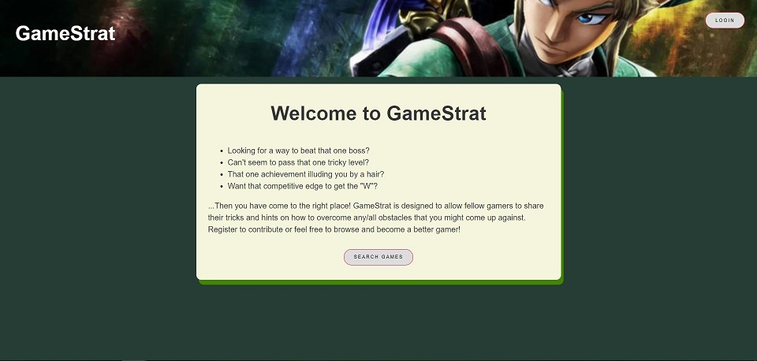
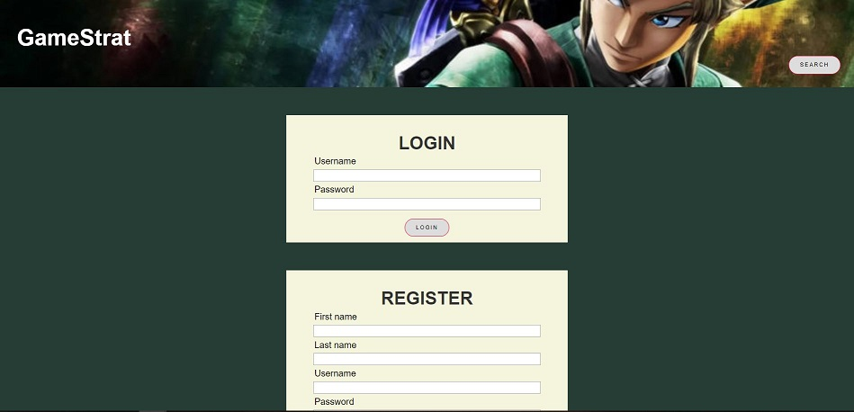
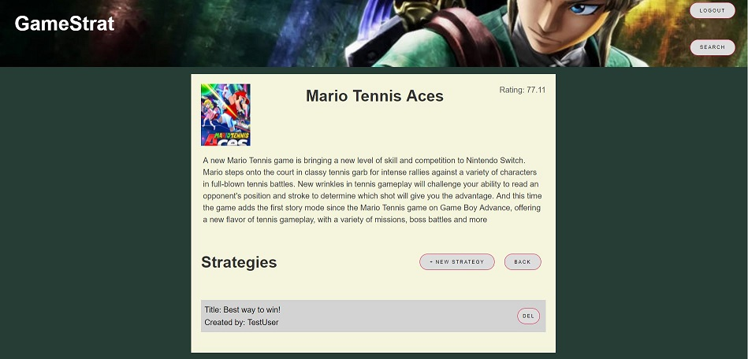
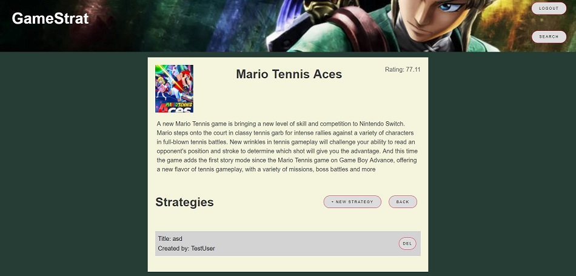
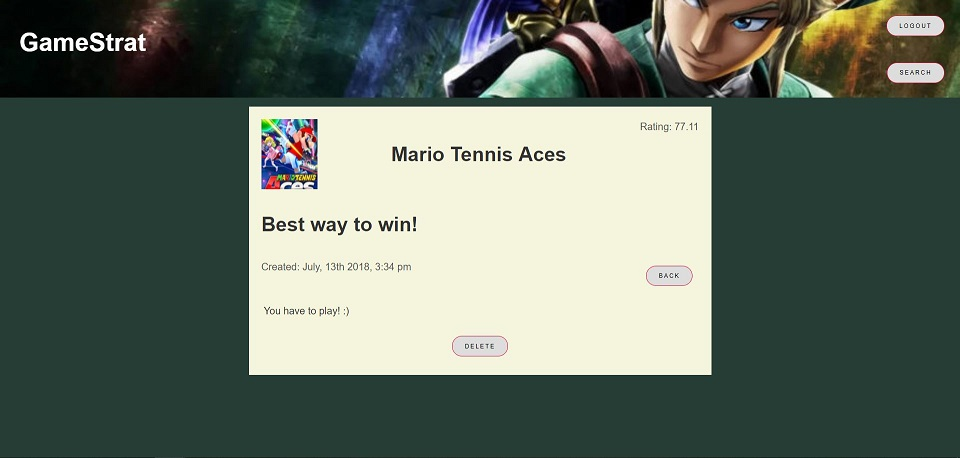

# Welcome to GameStrat!

  * Looking for a way to beat that one boss?
  * Can't seem to pass that one tricky level?
  * That one achievement illuding you by a hair?
  * Want that competitive edge to get the "W"?

...Then you have come to the right place! GameStrat is designed to
allow fellow gamers to share their tricks and hints on how to overcome
any/all obstacles that you might come up against. Register to
contribute or feel free to browse and become a better gamer!

If you register and become a user, you will be able to contribute to the
cause. You will now have the following privileges:

  * Add strategies to your favorite games
  * Manage and keep track of all of your strategies

...more features to come...

Let the collaboration begin...!

__________________________
## Below is a link to live app:
https://jonathan-gamestrat-client.herokuapp.com/

__________________________
## Screenshots of the Game

### Desktop View
##### Landing Page

##### Login and Register

##### Game Search

##### Individual Game

##### Individual Strategy

### Mobile View

##### Login and Register
![[MOBILE]Login](src/images/login-mobile.png)

##### Game Search
![[MOBILE]Game Search](src/images/search-mobile.png)

##### Individual Game
![[MOBILE]Individual Game](src/images/game-mobile1.png)
![[MOBILE]Individual Game](src/images/game-mobile2.png)

##### Individual Strategy
![[MOBILE]Individual Strategy](src/images/strat-mobile.png)

__________________________
## Tech Stack

### GameStrat is built using the following:
 
* HTML5
* Cascading Style Sheet/Flex Box
* JavaScript
* NodeJS
* MongoDB

### Client-Side

* React
* React Redux
* Redux From
* Redux Thunk
* JWT-Decode

### Server-Side

* Express
* Mongoose
* Morgan
* Passport
* JSONWedToken
* bcryptjs
__________________________
## Project's Key Parts Locations

### Client-Side
* Actions
* Components 
* Local Storage
* Reducers
* Store
* Styles
* Tests
* Validators

### Server-Side
* Models
* Passport
* Routes
* Tests
* Server - (index.js)